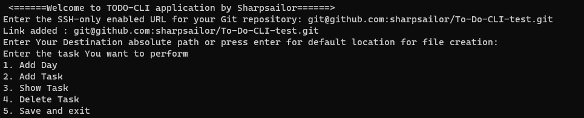
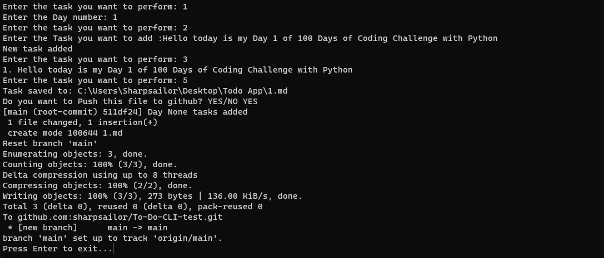

# TODO-CLI Application 
Demo:

https://github.com/sharpsailor/ToDo-Cli/assets/73359865/e3a9ee87-c5ac-4c11-aa39-4d4317ccd3ab


ScreenShots




## Check out the App here 
   
## Overview

Welcome to the TODO-CLI application by Sharpsailor ( [JITENDER SINGH](https://www.linkedin.com/in/sharpsailor/))! This command-line tool simplifies task management by providing a convenient interface to organize daily tasks and push them to a GitHub repository.

## Features

- **Task Management:** Add, view, and delete tasks for each day.
- **GitHub Integration:** Push tasks to a GitHub repository for version control.
- **Customizable Destination:** Choose a destination folder for task files.

## Installation

To use the TODO-CLI application, follow these steps:

1. **Clone the Repository:**
   ```
   git clone https://github.com/your-username/todo-cli.git
   cd todo-cli
    ```
2. **Run the Application:**
    
    ```
    python todo_cli.py

    ```
    

## Usage

### Adding a Day
1. Run the application.
2. Select the option to add a new day.
3. Enter the day number.
4. Add tasks for the day.

### Adding a Task
1. Run the application.
2. Select the option to add a task.
3. Enter the task details.

### Viewing Tasks
1. Run the application.
2. Select the option to view tasks.

### Deleting a Task
1. Run the application.
2. Select the option to delete a task.
3. Enter the task number to delete it.

### Saving and Exiting
1. Run the application.
2. Select the option to save and exit.

## GitHub Integration

Ensure your GitHub credentials are configured within the application for seamless integration. Upon exiting the application, choose whether to push tasks to your GitHub repository.

## Contributing

Contributions are welcome! Feel free to submit issues or pull requests.

## License

This project is licensed under the MIT License - see the [LICENSE](LICENSE) file for details.
